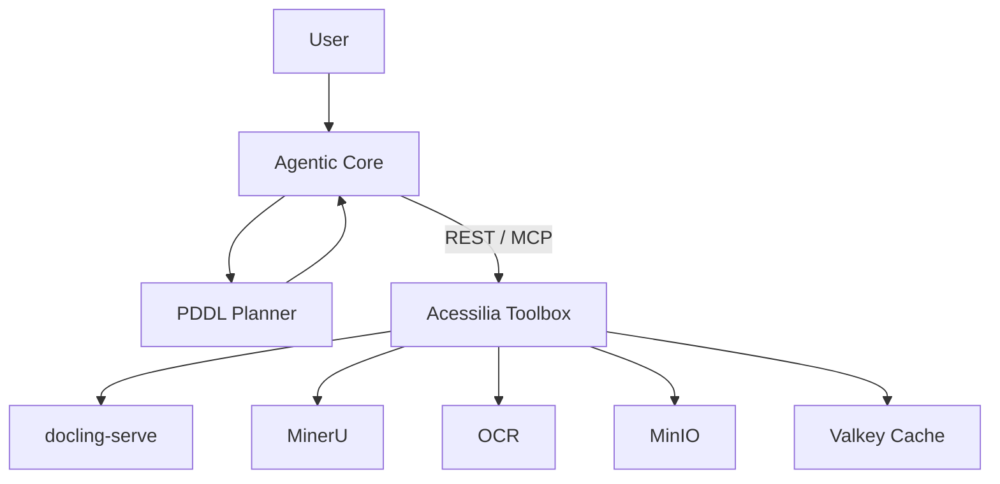

# Acessilia Toolbox

**A stateless, composable toolbox for exposing deterministic
capabilities to agentic systems via REST and MCP.**

---

## Quick start

```bash
# 1. Install
python3 -m venv .venv && source .venv/bin/activate
pip install -e ".[dev]"

# 2. Start the extraction provider (Docker required)
docker run -d --name docling-serve -p 5001:5001 \
  -v docling-models:/root/.cache/docling \
  ghcr.io/docling-project/docling-serve-cpu:v1.32.0

# 3. Configure
export DOCLING_SERVE_URL=http://localhost:5001

# 4. Start the toolbox
uvicorn "acessilia_toolbox.api.app:create_app" --factory --host 0.0.0.0 --port 8000

# 5. Open Swagger UI
open http://localhost:8000/v1/docs
```

### Test in one command

```bash
# Health check
curl http://localhost:8000/v1/health

# List capabilities
curl http://localhost:8000/v1/capabilities | python3 -m json.tool

# Extract a document (replace with any PDF)
curl -X POST http://localhost:8000/v1/capabilities/document.structure.extract:execute \
  -F "file=@/path/to/document.pdf" \
  -F "language=pt-BR" | python3 -m json.tool | head -50
```

### No PDF at hand? Generate one inline

```bash
python3 -c "
import struct
pdf = b'%%PDF-1.4\n1 0 obj<</Type/Catalog/Pages 2 0 R>>endobj\n'
pdf += b'2 0 obj<</Type/Pages/Kids[3 0 R]/Count 1>>endobj\n'
pdf += b'3 0 obj<</Type/Page/Parent 2 0 R/MediaBox[0 0 595 842]'
pdf += b'/Contents 4 0 R/Resources<</Font<</F1 5 0 R>>>>>>endobj\n'
pdf += b'4 0 obj<</Length 44>>stream\nBT /F1 24 Tf 72 760 Td(Ola Toolbox)Tj ET\nendstream\nendobj\n'
pdf += b'5 0 obj<</Type/Font/Subtype/Type1/BaseFont/Helvetica>>endobj\n'
pdf += b'xref\n0 6\n0000000000 65535 f\n'
for i,o in enumerate([1,2,3,4,5]): pdf += b'%%010d 00000 n\n' % (o,)
pdf += b'trailer<</Size 6/Root 1 0 R>>\nstartxref\n%%d\n%%%%EOF\n' % len(pdf)
open('/tmp/exemplo.pdf','wb').write(pdf)
"
curl -X POST http://localhost:8000/v1/capabilities/document.structure.extract:execute \
  -F "file=@/tmp/exemplo.pdf" \
  -F "language=pt-BR" | python3 -c "
import sys,json
r = json.load(sys.stdin)
for e in r['document']['elements']:
    print(f\"  [{e['type']}] {e['text']}\")
print(f\"  -> {r['provenance']['duration_ms']}ms via {r['provenance']['provider_version']}\")
"
```

Example output:

```
  [heading] Documento de teste
  -> 1872ms via 1.32.0
```

---

## What is the toolbox?

A capability gateway. It exposes **what can be done** (extract structure,
OCR, store artifacts, validate accessibility) through a provider-neutral
interface, so agents and applications never couple to Docling, MinerU or
any other vendor.

| Concept | Meaning |
|---|---|
| **Capability** | Stable, provider-neutral operation (`document.structure.extract`) |
| **Provider** | External service that implements a capability (`docling-serve`) |
| **Toolbox** | Mediates between agents and providers — validates, routes, caches, normalizes |
| **Agentic Core** | Owns goals, planning, provider selection — **outside** the toolbox |

## Architecture



## What it can do today

| Capability | Provider | Status |
|---|---|---|
| `document.structure.extract` | docling-serve | ✅ |
| `artifact.store` / `artifact.retrieve` | filesystem, MinIO (optional) | ✅ |
| `cache.get` / `cache.put` | Valkey (optional) | ✅ |

## Key endpoints

| Method | Path | Description |
|---|---|---|
| `GET` | `/v1/health` | Service status |
| `GET` | `/v1/capabilities` | List capabilities |
| `POST` | `/v1/capabilities/{id}:execute` | Execute a capability |
| `GET` | `/v1/providers` | List providers |
| `POST` | `/v1/artifacts` | Store content |
| `GET` | `/v1/artifacts/{id}` | Retrieve content |
| `GET` | `/v1/planning/domain` | PDDL domain fragment |
| `GET` | `/v1/planning/predicates` | PDDL predicates |

> Full API reference: [docs/api.md](docs/api.md)

## CLI

```bash
# List capabilities
acessilia-toolbox capabilities

# List providers
acessilia-toolbox providers --health

# Execute
acessilia-toolbox execute document.structure.extract documento.pdf -o resultado.json
```

## Documentation

| Document | What it covers |
|---|---|
| [Architecture](docs/architecture.md) | Boundaries, components, state ownership |
| [Installation](docs/installation.md) | Setup, Docker, config |
| [API](docs/api.md) | REST, MCP, error codes, manual testing |
| [Capability Model](docs/capability-model.md) | Contracts, manifests, interchangeability |
| [PDDL Integration](docs/pddl.md) | Planning semantics |
| [Testing](docs/testing.md) | Test layers, snapshot validation |
| [Constitution](docs/constitution.md) | Design principles |
| [Contributing](docs/contribution.md) | Workflow, PR checklist |

## License

MIT. Provider services retain their own licenses.
